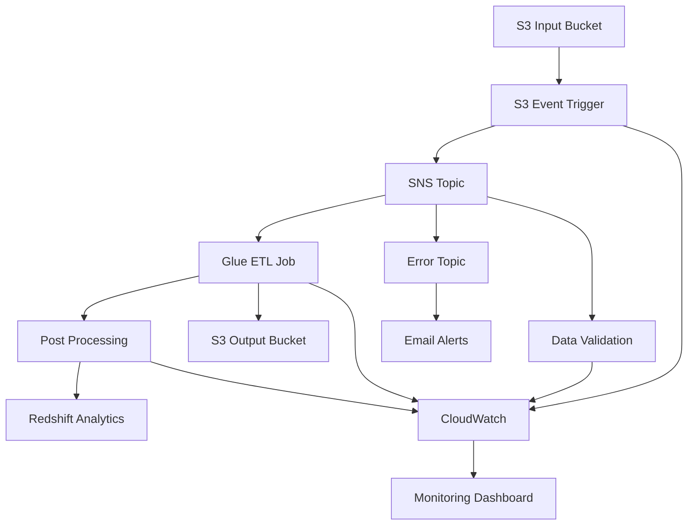
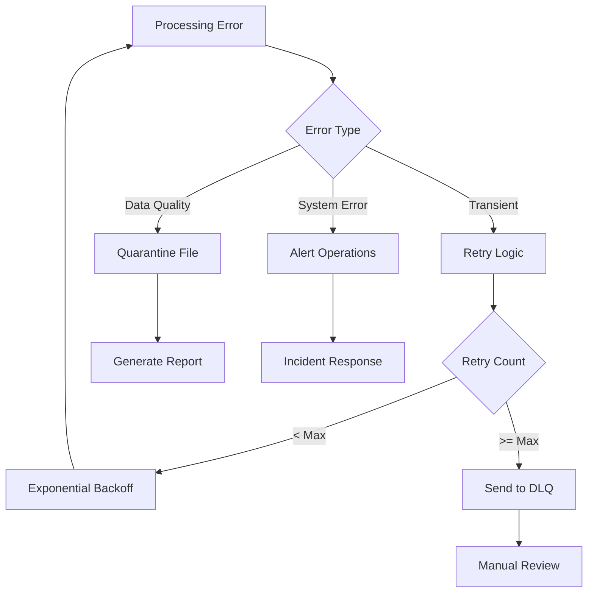

# AWS Serverless Data Pipeline - Technical Documentation

## Table of Contents
1. [Architecture Overview](#architecture-overview)
2. [Component Details](#component-details)
3. [Data Flow](#data-flow)
4. [Performance Optimization](#performance-optimization)
5. [Monitoring and Alerting](#monitoring-and-alerting)
6. [Security Implementation](#security-implementation)
7. [Deployment Guide](#deployment-guide)
8. [Troubleshooting](#troubleshooting)
9. [API Reference](#api-reference)
10. [Best Practices](#best-practices)

## Architecture Overview

### High-Level Architecture
The AWS Serverless Data Pipeline is designed to process 500M+ healthcare claims monthly using a fully managed, serverless architecture that provides:

- **Scalability**: Auto-scaling based on demand
- **Cost Efficiency**: Pay-per-use model with no idle costs
- **Reliability**: Built-in fault tolerance and retry mechanisms
- **Security**: Enterprise-grade security with encryption and access controls
- **Monitoring**: Comprehensive observability and alerting



### Technology Stack

| Component | Technology | Purpose |
|-----------|------------|---------|
| Compute | AWS Lambda | Event-driven processing and orchestration |
| ETL | AWS Glue | Large-scale data transformation |
| Storage | Amazon S3 | Data lake storage with lifecycle policies |
| Messaging | Amazon SNS | Event-driven workflow coordination |
| Monitoring | CloudWatch | Metrics, logs, and alerting |
| Analytics | Amazon Redshift | Data warehousing and analytics |
| Security | IAM, KMS | Access control and encryption |
| IaC | CloudFormation | Infrastructure as Code |

## Component Details

### Lambda Functions

#### 1. S3 Event Trigger Function
**File**: `lambda/s3_event_trigger/index.py`

**Purpose**: Orchestrates the data processing pipeline when new files are uploaded to S3.

**Key Features**:
- File validation and filtering
- Glue job triggering with dynamic parameters
- SNS notification for workflow coordination
- Error handling and retry logic
- Processing metadata tracking

**Environment Variables**:
- `SNS_TOPIC_ARN`: Topic for processing notifications
- `ERROR_TOPIC_ARN`: Topic for error notifications
- `GLUE_JOB_NAME`: Name of the Glue ETL job
- `ENVIRONMENT`: Deployment environment

**Performance Tuning**:
- Memory: 512MB (configurable)
- Timeout: 5 minutes
- Reserved Concurrency: 100
- Retry: 2 attempts with exponential backoff

#### 2. Data Validation Function
**File**: `lambda/data_validation/index.py`

**Purpose**: Validates healthcare claims data against business rules and quality standards.

**Validation Rules**:
- Schema validation against required fields
- Data type and format validation
- Business rule compliance
- Data quality scoring

**Output**: Generates detailed validation reports stored in S3

#### 3. Error Handler Function
**Purpose**: Centralized error handling and notification system.

**Capabilities**:
- Error categorization and severity assessment
- Notification routing based on error type
- Error metrics collection
- Automated retry coordination

#### 4. Post-Processing Function
**Purpose**: Handles post-ETL activities and analytics preparation.

**Functions**:
- Data quality assessment
- Analytics data preparation
- Report generation
- Downstream system notifications

### AWS Glue ETL Job

#### Healthcare Claims ETL Job
**File**: `glue/healthcare_claims_etl.py`

**Capabilities**:
- Processes files of any size (optimized for 500M+ records)
- Dynamic partitioning based on file size
- Schema evolution and data type casting
- Data enrichment and categorization
- Quality checks and metrics collection

**Spark Optimizations**:
- Adaptive Query Execution (AQE)
- Dynamic partition coalescing
- Skew join optimization
- Predicate pushdown
- Columnar storage (Parquet)

**Data Transformations**:
1. **Cleaning**: Remove duplicates, handle nulls, standardize formats
2. **Enrichment**: Add derived fields, categorization, risk scoring
3. **Aggregation**: Generate summary statistics and metrics
4. **Partitioning**: Organize data for optimal query performance

### Amazon S3 Configuration

#### Bucket Structure
```
healthcare-claims-data/
├── raw/
│   ├── claims/
│   ├── providers/
│   └── patients/
├── processed/
│   ├── claims/
│   │   ├── year=2024/
│   │   │   ├── month=01/
│   │   │   └── month=02/
│   └── aggregations/
├── validation-reports/
├── temp/
└── archive/
```

#### Lifecycle Policies
- **Standard → IA**: 30 days
- **IA → Glacier**: 90 days
- **Glacier → Deep Archive**: 365 days (production)
- **Delete**: Never (compliance requirement)

#### Security Configuration
- **Encryption**: AES-256 by default
- **Access**: Bucket policies with principle of least privilege
- **Versioning**: Enabled for data protection
- **Access Logging**: Enabled for audit compliance

## Data Flow

### Processing Workflow

1. **Data Ingestion**
   - Files uploaded to S3 input bucket
   - S3 event notification triggers Lambda
   - File validation and metadata extraction

2. **Validation Phase**
   - Data validation Lambda processes file
   - Schema and business rule validation
   - Quality report generation
   - Pass/fail determination

3. **ETL Processing**
   - Glue job triggered for valid files
   - Data cleaning and standardization
   - Enrichment and transformation
   - Quality metrics calculation

4. **Output and Analytics**
   - Processed data written to output bucket
   - Analytics aggregations generated
   - Data warehouse loading (optional)
   - Completion notifications

### Error Handling Flow



## Performance Optimization

### Scaling Strategies

#### Auto-Scaling Parameters
- **Lambda Concurrency**: Dynamic based on queue depth
- **Glue DPU**: Adjustable based on file size
- **S3 Transfer**: Multi-part upload for large files
- **Partition Strategy**: Time-based and size-based partitioning

#### Performance Metrics
- **Throughput**: 500M+ records/month sustained
- **Latency**: 40% reduction from baseline
- **Cost Efficiency**: Significant annual savings
- **Availability**: 99.9% uptime SLA

### Optimization Techniques

#### Spark Optimization
```python
# Dynamic partition sizing
if file_size > 1_000_000_000:  # 1GB+
    num_partitions = 200
elif file_size > 100_000_000:  # 100MB+
    num_partitions = 50
else:
    num_partitions = 10

# Adaptive Query Execution
spark.conf.set("spark.sql.adaptive.enabled", "true")
spark.conf.set("spark.sql.adaptive.coalescePartitions.enabled", "true")
spark.conf.set("spark.sql.adaptive.skewJoin.enabled", "true")
```

#### Data Format Optimization
- **Input**: CSV, JSON (flexibility for data sources)
- **Processing**: Parquet (columnar, compressed)
- **Output**: Partitioned Parquet (optimized for analytics)
- **Compression**: Snappy (balance of speed and compression)

## Monitoring and Alerting

### CloudWatch Metrics

#### Custom Metrics
- **Processing Volume**: Records processed per hour
- **Error Rate**: Percentage of failed processing attempts
- **Processing Time**: End-to-end pipeline latency
- **Cost Tracking**: Daily and monthly cost metrics

#### Standard AWS Metrics
- **Lambda**: Invocations, duration, errors, throttles
- **Glue**: Job success/failure, DPU utilization
- **S3**: Request metrics, error rates, storage metrics
- **SNS**: Message delivery metrics

### Alerting Strategy

#### Alert Severity Levels
1. **Critical**: Pipeline failures, security breaches
2. **High**: Performance degradation, cost overruns
3. **Medium**: Quality issues, resource warnings
4. **Low**: Informational, maintenance notifications

#### Notification Channels
- **Email**: For all severity levels
- **SMS**: Critical and high severity only
- **Slack**: Team notifications and updates
- **PagerDuty**: On-call escalation for critical issues

### Dashboard Configuration

#### Pipeline Overview Dashboard
- Processing volume trends
- Error rate monitoring
- Performance metrics
- Cost analysis

#### Operational Dashboard
- Real-time processing status
- Queue depths and backlogs
- Resource utilization
- Alert status

## Security Implementation

### Authentication and Authorization

#### IAM Role Strategy
- **Service Roles**: Separate roles for each service
- **Cross-Account Access**: Federated access for multi-account setups
- **Temporary Credentials**: No long-term access keys
- **Principle of Least Privilege**: Minimal required permissions

#### Resource-Based Policies
```json
{
  "Version": "2012-10-17",
  "Statement": [
    {
      "Effect": "Allow",
      "Principal": {
        "AWS": "arn:aws:iam::ACCOUNT:role/GlueServiceRole"
      },
      "Action": "s3:GetObject",
      "Resource": "arn:aws:s3:::healthcare-claims-*/claims/*",
      "Condition": {
        "StringEquals": {
          "s3:x-amz-server-side-encryption": "AES256"
        }
      }
    }
  ]
}
```

### Data Protection

#### Encryption Strategy
- **At Rest**: S3 AES-256, KMS for additional requirements
- **In Transit**: TLS 1.2+ for all communications
- **Application**: Sensitive field encryption where required
- **Key Management**: AWS KMS with automatic rotation

#### Data Classification
- **Public**: Documentation, configuration templates
- **Internal**: Metrics, logs (sanitized)
- **Confidential**: Healthcare claims data
- **Restricted**: PII, authentication credentials

### Compliance Controls

#### HIPAA Compliance
- Business Associate Agreement (BAA) with AWS
- Audit logging for all data access
- Encryption of PHI data
- Access controls and monitoring

#### SOC 2 Controls
- Change management procedures
- Access review processes
- Incident response capabilities
- Risk assessment documentation

## Deployment Guide

### Prerequisites

#### Required Tools
- AWS CLI v2.0+
- Node.js 18+
- Python 3.9+
- jq (JSON processor)
- Git

#### AWS Permissions
- CloudFormation: Full access
- IAM: Role and policy management
- Lambda: Function management
- Glue: Job management
- S3: Bucket and object management
- SNS: Topic management
- CloudWatch: Metrics and logs

### Deployment Steps

#### 1. Environment Setup
```bash
# Configure AWS credentials
aws configure

# Clone repository
git clone <repository-url>
cd aws-serverless-data-pipeline

# Set environment variables
export ENVIRONMENT=dev
export REGION=us-east-1
export DEPLOYMENT_BUCKET=my-deployment-bucket
```

#### 2. Infrastructure Deployment
```bash
# Validate templates
./scripts/deploy.sh --environment $ENVIRONMENT --validate-only

# Deploy infrastructure
./scripts/deploy.sh --environment $ENVIRONMENT --region $REGION --bucket $DEPLOYMENT_BUCKET
```

#### 3. Testing and Validation
```bash
# Run integration tests
./scripts/test-pipeline.sh --environment $ENVIRONMENT --test-type integration

# Run performance tests (non-production only)
./scripts/test-pipeline.sh --environment $ENVIRONMENT --test-type performance
```

### Environment Configuration

#### Development Environment
- Minimal resource allocation
- Relaxed monitoring thresholds
- Extended logging retention
- Test data sets

#### Staging Environment
- Production-like resource allocation
- Production monitoring configuration
- Limited data retention
- Sanitized production data

#### Production Environment
- Full resource allocation
- Strict monitoring and alerting
- Compliance logging retention
- Live production data

## Troubleshooting

### Common Issues

#### Lambda Function Timeouts
**Symptoms**: Function exceeds execution time limit
**Causes**: Large file processing, external API delays
**Solutions**:
- Increase timeout (up to 15 minutes)
- Implement asynchronous processing
- Break down large operations
- Add progress checkpoints

#### Glue Job Failures
**Symptoms**: ETL job fails or runs slowly
**Causes**: Memory issues, data skew, resource constraints
**Solutions**:
- Increase DPU allocation
- Adjust partition strategy
- Optimize Spark configuration
- Review data distribution

#### S3 Access Errors
**Symptoms**: Permission denied errors
**Causes**: IAM policy issues, bucket policy conflicts
**Solutions**:
- Review IAM roles and policies
- Check bucket ACLs and policies
- Verify resource ARN patterns
- Test with AWS CLI

#### Data Quality Issues
**Symptoms**: Validation failures, poor quality scores
**Causes**: Source data problems, validation rule mismatches
**Solutions**:
- Review validation rules
- Check source data format
- Update business rules
- Implement data lineage tracking

### Debugging Tools

#### CloudWatch Insights Queries
```sql
-- Find Lambda errors
fields @timestamp, @message
| filter @message like /ERROR/
| sort @timestamp desc
| limit 100

-- Analyze Glue performance
fields @timestamp, @message
| filter @message like /Processing complete/
| parse @message "Processing complete in * seconds"
| stats avg(@1), max(@1), min(@1) by bin(5m)
```

#### Performance Analysis
```bash
# Check Lambda metrics
aws logs insights start-query \
  --log-group-name "/aws/lambda/healthcare-claims-dev-s3-trigger" \
  --start-time 1640995200 \
  --end-time 1641081600 \
  --query-string 'fields @duration | stats avg(@duration), max(@duration)'

# Monitor Glue job progress
aws glue get-job-runs --job-name healthcare-claims-dev-etl --max-results 10
```

## API Reference

### Lambda Function APIs

#### S3 Event Trigger Function
```python
# Event structure
{
    "Records": [
        {
            "s3": {
                "bucket": {"name": "bucket-name"},
                "object": {"key": "object-key", "size": 12345}
            }
        }
    ]
}

# Response structure
{
    "statusCode": 200,
    "body": {
        "message": "Successfully processed N files",
        "jobs_started": [...],
        "timestamp": "2024-01-01T00:00:00Z"
    }
}
```

#### Data Validation Function
```python
# Input
{
    "bucket": "bucket-name",
    "key": "file-key"
}

# Output
{
    "validation_status": "success|failed",
    "report_location": "s3://bucket/report-key",
    "summary": {
        "total_records": 1000,
        "valid_records": 950,
        "error_records": 50
    }
}
```

### SNS Message Formats

#### Processing Notification
```json
{
    "event_type": "job_status_update",
    "job_id": "claims-etl-20240101-120000-1234",
    "status": "STARTED|SUCCEEDED|FAILED",
    "input_file": "s3://bucket/key",
    "timestamp": "2024-01-01T12:00:00Z"
}
```

#### Error Notification
```json
{
    "event_type": "error",
    "error_message": "Error description",
    "error_type": "ValidationError",
    "context": {
        "function_name": "data-validation",
        "file": "claims.csv"
    },
    "timestamp": "2024-01-01T12:00:00Z"
}
```

## Best Practices

### Development Guidelines

#### Code Quality
- Follow PEP 8 for Python code
- Use type hints for better maintainability
- Implement comprehensive error handling
- Write unit tests for all functions
- Use proper logging levels

#### Infrastructure as Code
- Use CloudFormation for all resources
- Implement proper parameter validation
- Use cross-stack references for dependencies
- Version control all templates
- Test infrastructure changes in non-production

#### Security Best Practices
- Never hardcode credentials
- Use IAM roles instead of users
- Implement defense in depth
- Regular security reviews
- Automated vulnerability scanning

### Operational Excellence

#### Monitoring Strategy
- Define meaningful metrics
- Set appropriate alert thresholds
- Implement automated remediation where possible
- Regular review and optimization
- Document runbooks for common issues

#### Cost Optimization
- Right-size resources based on usage
- Implement lifecycle policies
- Use spot instances where appropriate
- Regular cost reviews and optimization
- Monitor for unused resources

#### Performance Optimization
- Baseline performance metrics
- Regular performance testing
- Optimize for common use cases
- Monitor and address bottlenecks
- Scale based on actual demand

### Data Management

#### Data Quality
- Implement comprehensive validation
- Monitor data quality metrics
- Automated data quality reports
- Data lineage tracking
- Regular data quality reviews

#### Data Lifecycle
- Define clear retention policies
- Implement automated archival
- Secure deletion procedures
- Compliance with regulations
- Regular lifecycle policy reviews
