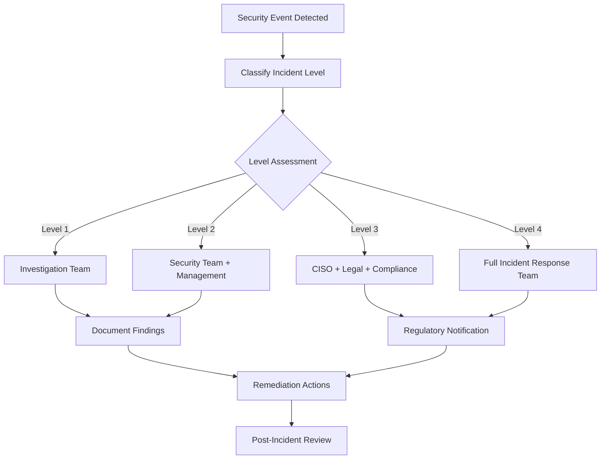

# Security Policies and Guidelines

## IAM Security Policies

### Lambda Execution Policy
```json
{
    "Version": "2012-10-17",
    "Statement": [
        {
            "Effect": "Allow",
            "Action": [
                "s3:GetObject",
                "s3:PutObject"
            ],
            "Resource": [
                "arn:aws:s3:::healthcare-claims-*/*"
            ],
            "Condition": {
                "StringEquals": {
                    "s3:x-amz-server-side-encryption": "AES256"
                }
            }
        },
        {
            "Effect": "Allow",
            "Action": [
                "sns:Publish"
            ],
            "Resource": [
                "arn:aws:sns:*:*:healthcare-claims-*"
            ]
        },
        {
            "Effect": "Allow",
            "Action": [
                "glue:StartJobRun",
                "glue:GetJobRun",
                "glue:GetJobRuns"
            ],
            "Resource": [
                "arn:aws:glue:*:*:job/healthcare-claims-*"
            ]
        },
        {
            "Effect": "Allow",
            "Action": [
                "logs:CreateLogGroup",
                "logs:CreateLogStream",
                "logs:PutLogEvents"
            ],
            "Resource": "arn:aws:logs:*:*:log-group:/aws/lambda/healthcare-claims-*"
        }
    ]
}
```

### Glue Service Policy
```json
{
    "Version": "2012-10-17",
    "Statement": [
        {
            "Effect": "Allow",
            "Action": [
                "s3:GetObject",
                "s3:PutObject",
                "s3:DeleteObject",
                "s3:ListBucket"
            ],
            "Resource": [
                "arn:aws:s3:::healthcare-claims-*",
                "arn:aws:s3:::healthcare-claims-*/*"
            ]
        },
        {
            "Effect": "Allow",
            "Action": [
                "sns:Publish"
            ],
            "Resource": [
                "arn:aws:sns:*:*:healthcare-claims-*"
            ]
        },
        {
            "Effect": "Deny",
            "Action": "*",
            "Resource": "*",
            "Condition": {
                "StringNotEquals": {
                    "aws:RequestedRegion": ["us-east-1", "us-west-2"]
                }
            }
        }
    ]
}
```

## Data Security Guidelines

### 1. Data Classification
- **Public**: Marketing materials, public documentation
- **Internal**: Configuration files, deployment scripts
- **Confidential**: Healthcare claims data, patient information
- **Restricted**: Authentication credentials, encryption keys

### 2. Encryption Standards

#### Data at Rest
- S3: AES-256 encryption for all buckets
- RDS: Encryption enabled for all database instances
- EBS: Encryption enabled for all volumes
- CloudWatch Logs: Encryption with customer-managed KMS keys

#### Data in Transit
- TLS 1.2 minimum for all HTTPS connections
- VPC endpoints for AWS service communication
- Encrypted SNS topics
- Secure Lambda environment variables

### 3. Access Control

#### Principle of Least Privilege
- IAM roles with minimal required permissions
- Resource-based policies with specific ARN patterns
- Time-based access controls where applicable
- Regular access reviews and cleanup

#### Multi-Factor Authentication
- MFA required for all administrative access
- Cross-account role assumptions require MFA
- Emergency access procedures documented

### 4. Network Security

#### VPC Configuration
- Private subnets for all compute resources
- No direct internet access for processing components
- VPC Flow Logs enabled for network monitoring
- Network ACLs configured for defense in depth

#### Security Groups
- Default deny-all rules
- Specific port and protocol permissions
- Source IP restrictions where possible
- Regular security group audits

### 5. Data Loss Prevention

#### Backup Strategy
- Automated daily backups with 30-day retention
- Cross-region backup replication
- Point-in-time recovery capabilities
- Regular backup restore testing

#### Data Lifecycle Management
- Automated data archival policies
- Secure data deletion procedures
- Data retention compliance (HIPAA requirements)
- Data sovereignty considerations

## Compliance and Audit

### 1. HIPAA Compliance
- Business Associate Agreements (BAA) with AWS
- PHI data handling procedures
- Audit trail requirements
- Risk assessment documentation

### 2. SOC 2 Type II
- Control environment documentation
- Risk assessment procedures
- Monitoring and logging requirements
- Incident response procedures

### 3. GDPR Compliance
- Data subject rights procedures
- Data processing impact assessments
- Privacy by design principles
- Data breach notification procedures

## Security Monitoring

### 1. CloudTrail Configuration
```yaml
CloudTrail:
  S3BucketName: security-audit-logs-bucket
  IncludeGlobalServiceEvents: true
  IsMultiRegionTrail: true
  EnableLogFileValidation: true
  EventSelectors:
    - ReadWriteType: All
      IncludeManagementEvents: true
      DataResources:
        - Type: "AWS::S3::Object"
          Values: ["arn:aws:s3:::healthcare-claims-*/*"]
```

### 2. CloudWatch Security Metrics
- Failed authentication attempts
- Unusual API call patterns
- Data access anomalies
- Resource configuration changes

### 3. AWS Config Rules
- S3 bucket encryption enabled
- Security group compliance
- IAM password policy compliance
- Resource tagging compliance

## Incident Response

### 1. Security Incident Classification
- **Level 1**: Potential security event requiring investigation
- **Level 2**: Confirmed security incident with limited impact
- **Level 3**: Major security breach with data compromise risk
- **Level 4**: Critical security incident with confirmed data breach

### 2. Response Procedures


### 3. Communication Plan
- Internal notification procedures
- Customer communication templates
- Regulatory reporting requirements
- Media response guidelines

## Security Testing

### 1. Vulnerability Assessment
- Monthly automated vulnerability scans
- Quarterly penetration testing
- Annual third-party security assessments
- Continuous security monitoring

### 2. Code Security Reviews
- Static Application Security Testing (SAST)
- Dynamic Application Security Testing (DAST)
- Dependency vulnerability scanning
- Infrastructure as Code security analysis

### 3. Security Metrics
- Mean Time to Detection (MTTD)
- Mean Time to Response (MTTR)
- Vulnerability remediation time
- Security training completion rates

## Developer Security Guidelines

### 1. Secure Coding Practices
- Input validation and sanitization
- Proper error handling without information disclosure
- Secure session management
- Protection against injection attacks

### 2. Secret Management
- No hardcoded credentials in source code
- Use of AWS Secrets Manager or Parameter Store
- Regular secret rotation procedures
- Secure secret distribution methods

### 3. Code Review Requirements
- Mandatory security review for all changes
- Automated security testing in CI/CD pipeline
- Security champion program
- Security training for all developers

## Emergency Procedures

### 1. Security Breach Response
1. **Immediate Actions**
   - Isolate affected systems
   - Preserve evidence
   - Notify security team
   - Begin incident log

2. **Assessment Phase**
   - Determine scope of breach
   - Identify affected data
   - Assess business impact
   - Document timeline

3. **Containment**
   - Stop ongoing unauthorized access
   - Prevent further data loss
   - Implement temporary controls
   - Coordinate with stakeholders

4. **Recovery**
   - Restore systems to normal operation
   - Implement additional security measures
   - Monitor for ongoing threats
   - Validate security posture

### 2. Contact Information
- **Security Operations Center**: security-soc@company.com
- **CISO Office**: ciso@company.com
- **Legal Team**: legal@company.com
- **Compliance Officer**: compliance@company.com

## Regular Security Reviews

### 1. Monthly Reviews
- Access control audit
- Security metrics review
- Vulnerability assessment results
- Incident response effectiveness

### 2. Quarterly Reviews
- Risk assessment updates
- Security policy reviews
- Third-party vendor assessments
- Business continuity testing

### 3. Annual Reviews
- Comprehensive security audit
- Penetration testing results
- Compliance certification renewal
- Security strategy planning
